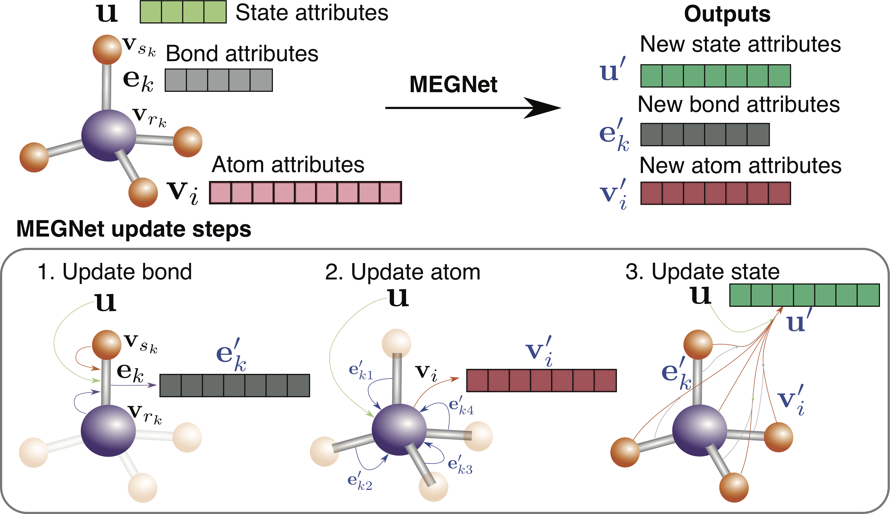
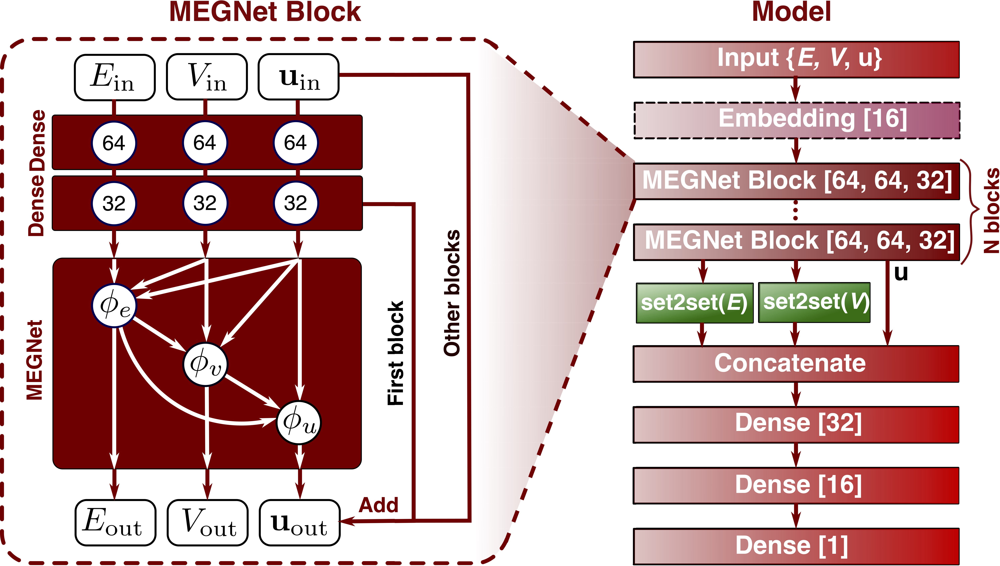

# Preamble

This repository represents the efforts of the Materials Virtual Lab in developing graph networks for machine learning in materials science. It is a work in progress and the models we have developed thus far are only based on our best efforts. We welcome efforts by anyone to build and test models using our code and data, all of which are publicly available. Any comments or suggestions are also welcome (please post on the Github Issues page.)

# MatErials Graph Networks (MEGNet) for molecule/crystal property prediction

MatErials Graph Network (MEGNet) is an implementation of DeepMind's graph networks[1] for universal machine learning in materials science. We have demonstrated its success in achieving very low prediction errors in a broad array of properties in both molecules and crystals (see preprint of our paper ["Graph Networks as a Universal Machine Learning Framework for Molecules and Crystals"](https://arxiv.org/abs/1812.05055)[2]).

Briefly, Figure 1 shows the sequential update steps of the graph network, whereby bonds, atoms, and global state attributes are updated using information from each other, generating an output graph.


<div align='center'><strong>Figure 1. The graph network update function.</strong></div>

Figure 2 shows the overall schematic of the MEGNet. Each graph network module is preceded by two multi-layer perceptrons (known as Dense layers in Keras terminology), constituting a MEGNet block. Multiple MEGNet blocks can be stacked, allowing for information flow across greater spatial distances. The number of blocks required depend on the range of interactions necessary to predict a target property. In the final step, a `set2set` is used to map the output to a scalar/vector property.


<div align='center'><strong>Figure 2. Schematic of MatErials Graph Network.</strong></div>

## Usage

A fast model building tool is in the `megnet.model` module, and the corresponding tests explain the usage. A simple model building example is as follows:

```python
from keras.layers import Input, Dense
from keras.models import Model
from megnet.layers import MEGNet, Set2Set

n_atom_feature= 20
n_bond_feature = 10
n_global_feature = 2

# Define model inputs
int32 = 'int32'
x1 = Input(shape=(None, n_atom_feature)) # atom feature placeholder
x2 = Input(shape=(None, n_bond_feature)) # bond feature placeholder
x3 = Input(shape=(None, n_global_feature)) # global feature placeholder
x4 = Input(shape=(None,), dtype=int32) # bond index1 placeholder
x5 = Input(shape=(None,), dtype=int32) # bond index2 placeholder
x6 = Input(shape=(None,), dtype=int32) # atom_ind placeholder
x7 = Input(shape=(None,), dtype=int32) # bond_ind placeholder
xs = [x1, x2, x3, x4, x5, x6, x7]

# Pass the inputs to the MEGNet layer
# Here the list are the hidden units + the output unit, 
# you can have others like [n1] or [n1, n2, n3 ...] if you want. 
out = MEGNet([32, 16], [32, 16], [32, 16], pool_method='mean', activation='relu')(xs)

# the output is a tuple of new graphs V, E and u
# Since u is a per-structure quantity, 
# we can directly use it to predict per-structure property
out = Dense(1)(out[2])

# Set up the model and compile it!
model = Model(inputs=xs, outputs=out)
model.compile(loss='mse', optimizer='adam')
```

With less than 20 lines of code, you have built a graph network model that is ready for materials property prediction!

For model details and benchmarks, please refer to the preprint of our paper ["Graph Networks as a Universal Machine Learning Framework for Molecules and Crystals"](https://arxiv.org/abs/1812.05055)[2]

## Implementation details

Graph networks[1] are a superclass of graph-based neural networks. There are a few innovations compared to conventional graph-based neural neworks. 

* Global state attributes are added to the node/edge graph representation. These features work as a portal for structure-independent features such as temperature, pressure etc and also are an information exchange placeholder that facilitates information passing across longer spatial domains. 
* The update function involves the message interchange among all three levels of information, i.e., the node, bond and state information. It is therefore a highly general model.

The `MEGNet` model implements two major components: (a) the `graph network` layer and (b) the `set2set` layer.[3] The layers are based on [keras](https://keras.io/) API and is thus compatible with other keras modules. 

Different crystals/molecules have different number of atoms. Therefore it is impossible to use data batches without padding the structures to make them uniform in atom number. `MEGNet` takes a different approach. Instead of making structure batches, we assemble many structures into one giant structure and this structure has a vector output with each entry being the target value for the corresponding structure. Therefore, the batch number is always 1. 

Assuming a structure has N atoms and M bonds, a structure graph is represented as **V** (nodes/vertices, representing atoms), **E** (edges, representing bonds) and **u** (global state vector). **V** is a N\*Nv matrix. **E** comprises of a M\*Nm matrix for the bond attributes and index pairs (rk, sk) for atoms connected by each bond. **u** is a vector with length Nu. We vectorize rk and sk to form `index1` and `index2`, both are vectors with length M. In summary, the graph is a data structure with **V** (N\*Nv), **E** (M\*Nm), **u** (Nu, ), `index1` (M, ) and `index2` (M, ). 

We then assemble several structures together. For **V**, we directly append the atomic attributes from all structures, forming a matrix (1\*N'\*Nv), where N' > N. To indicate the belongingness of each atom attribute vector, we use a `atom_ind` vector. For example if `N'=5` and the first 3 atoms belongs to the first structure and the remainings the second structure, our `atom_ind` vector would be `[0, 0, 0, 1, 1]`. For the bond attribute, we perform the same appending method, and use `bond_ind` vector to indicate the bond belongingness. For `index1` and `index2`, we need to shift the integer values. For example, if `index1` and `index2` are `[0, 0, 1, 1]` and `[1, 1, 0, 0]` for structure 1 and are `[0, 0, 1, 1]` and `[1, 1, 0, 0]` for structure two. The assembled indices are `[0, 0, 1, 1, 2, 2, 3, 3]` and `[1, 1, 0, 0, 3, 3, 2, 2]`. Finally **u** expands a new dimension to take into account of the number of structures, and becomes a `1\*Ng\*Nu` tensor, where Ng is the number of structures. `1` is added as the first dimension of all inputs because we fixed the batch size to be 1 (1 giant graph) to comply the keras inputs requirements. 

In summary the inputs for the model is **V** (1\*N'\*Nv), **E** (1\*M'\*Nm), **u** (1\*Ng\*Nu), `index1` (1\*M'), `index2` (1\*M'), `atom_ind` (1\*N'), and `bond_ind` (1\*M'). For Z-only atomic features, **V** is a (1\*N') vector.

## Data sets

To aid others in reproducing (and improving on) our results, we have provided our MP-crystals-2018.6.1 crystal data set via [figshare](https://figshare.com/articles/Graphs_of_materials_project/7451351)[4]. The MP-crystals-2018.6.1 data set comprises the DFT-computed energies and band gaps of 69,640 crystals from the [Materials Project](http://www.materialsproject.org) obtained via the [Python Materials Genomics (pymatgen)](http://pymatgen.org) interface to the Materials Application Programming Interface (API)[5] on June 1, 2018. The crystal graphs were constructed using a radius cut-off of 4 angstroms. Using this cut-off, 69,239 crystals do not form isolated atoms and are used in the models. A subset of 5830 structures have elasticity data that do not have calculation warnings and will be used for elasticity models.

The molecule data set used in this work is the QM9 data set 30 processed by Faber et al.[6] It contains the B3LYP/6-31G(2df,p)-level DFT calculation results on 130,462 small organic molecules containing up to 9 heavy atoms.

## References

1. Battaglia, P. W.; Hamrick, J. B.; Bapst, V.; Sanchez-Gonzalez, A.; Zambaldi, V.; Malinowski, M.; Tacchetti, A.; Raposo, D.; Santoro, A.; Faulkner, R.; et al. Relational inductive biases, deep learning, and graph networks. 2018, 1–38. [arXiv:1806.01261](https://arxiv.org/abs/1806.01261)
2. Chen, Chi; Ye, Weike Ye; Zuo, Yunxing; Zheng, Chen; Ong, Shyue Ping. Graph Networks as a Universal Machine Learning Framework for Molecules and Crystals, 2018, arXiv preprint. [arXiv:1812.05055](https://arxiv.org/abs/1812.05055)
3. Vinyals, O.; Bengio, S.; Kudlur, M. Order Matters: Sequence to sequence for sets. 2015, arXiv preprint. [arXiv:1511.06391](https://arxiv.org/abs/1511.06391)
4. https://figshare.com/articles/Graphs_of_materials_project/7451351
5. Ong, S. P.; Cholia, S.; Jain, A.; Brafman, M.; Gunter, D.; Ceder, G.; Persson, K. A. The Materials Application Programming Interface (API): A simple, flexible and efficient API for materials data based on REpresentational State Transfer (REST) principles. Comput. Mater. Sci. 2015, 97, 209–215 DOI: [10.1016/j.commatsci.2014.10.037](http://dx.doi.org/10.1016/j.commatsci.2014.10.037).
6. Faber, F. A.; Hutchison, L.; Huang, B.; Gilmer, J.; Schoenholz, S. S.; Dahl, G. E.; Vinyals, O.; Kearnes, S.; Riley, P. F.; von Lilienfeld, O. A. Prediction errors of molecular machine learning models lower than hybrid DFT error. Journal of Chemical Theory and Computation 2017, 13, 5255–5264. DOI: [10.1021/acs.jctc.7b00577](http://dx.doi.org/10.1021/acs.jctc.7b00577)
